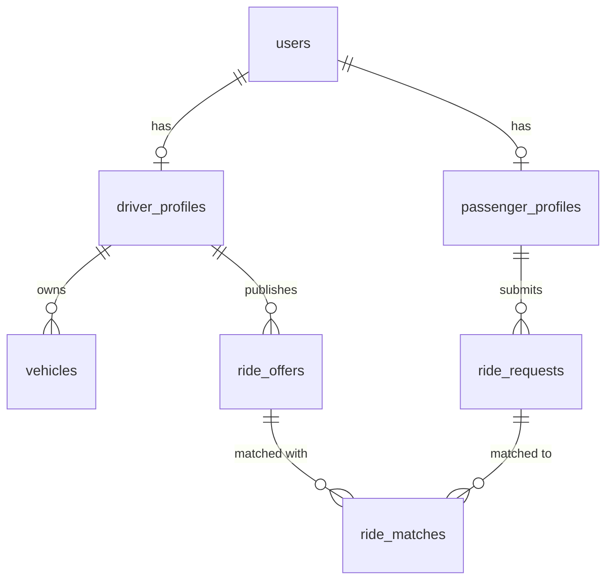

# TERRA & WAYPOINT — Master Engineering & Interview Handbook

> **Mentorship Note**: Welcome! This document is designed specifically to take you from first-principles concepts to cracking technical interviews at companies like **Google**, **Uber**, **Amazon**, **Microsoft**, **Atlassian**, **Adobe**, and **Walmart**.
> 
> Read this document in three passes:
> 1. **First Pass**: Understand the concepts, jargon, and analogies.
> 2. **Second Pass**: Learn how the algorithms, database indexes, and system flows connect.
> 3. **Third Pass**: Practice the **Interview Answers**, **Follow-up Questions**, and **Red Flags** out loud.

---

## 📚 Table of Contents
1. [Chapter 1: The Big Picture — What is Terra & Waypoint?](#chapter-1-the-big-picture)
2. [Chapter 2: Architecture — Modular Monolith vs Microservices](#chapter-2-architecture)
3. [Chapter 3: The Backend Engine — Node.js, Fastify & Event Loop](#chapter-3-the-backend-engine)
4. [Chapter 4: Data Layer — PostgreSQL, PostGIS & Relational Design](#chapter-4-data-layer)
5. [Chapter 5: Geospatial Computing — Geohashing & GiST Indexes](#chapter-5-geospatial-computing)
6. [Chapter 6: The Matching Engine Pipeline & Math](#chapter-6-the-matching-engine)
7. [Chapter 7: Real-Time Layer — Socket.IO, WebSockets & Redis](#chapter-7-real-time-layer)
8. [Chapter 8: Security & Authentication — JWT, bcrypt & RBAC](#chapter-8-security--authentication)
9. [Chapter 9: Deterministic Ride Lifecycle State Machine](#chapter-9-ride-lifecycle)
10. [Chapter 10: Multi-Factor Trust Score Algorithm](#chapter-10-trust-score)
11. [Chapter 11: Production Deployment — Docker & NGINX](#chapter-11-production-deployment)
12. [Chapter 12: Interview Q&A Cheatsheet & Red Flags](#chapter-12-interview-cheatsheet)

---

<a name="chapter-1-the-big-picture"></a>
# Chapter 1: The Big Picture — What is Terra & Waypoint?

⭐ **HIGH INTERVIEW IMPORTANCE**

### 1. Beginner Explanation
Imagine you want to build a smart city platform called **Terra**. A smart city needs many applications:
- Ride matching for commuters (**Waypoint**).
- Reporting broken roads or potholes (**CivicPulse**).
- Emergency dispatch for ambulances and police (**Sentinel**).

Instead of building 5 separate, disconnected projects from scratch, **Terra** is built as a single unified **Platform Engine**. **Waypoint** is the first fully working module on top of Terra.

```
+-------------------------------------------------------------------------+
|                              TERRA PLATFORM                             |
|                                                                         |
|  +-------------------------------------------------------------------+  |
|  |                     WAYPOINT MOBILITY MODULE                      |  |
|  |  (100% Production Ready Flagship - Ride Matching & Navigation)     |  |
|  +-------------------------------------------------------------------+  |
|                                    |                                    |
|  +-------------------------------------------------------------------+  |
|  |                   TERRA SHARED PLATFORM KERNEL                    |  |
|  |  (Auth JWT, Real-Time Socket.IO, PostGIS Pool, Redis, Event Bus)   |  |
|  +-------------------------------------------------------------------+  |
+-------------------------------------------------------------------------+
```

### 2. Technical Explanation
Terra is structured as a **Modular Monolith**. The core infrastructure (Authentication, Socket.IO WebSockets, Database Connections, Spatial Indexing, Event Bus) lives in `@terra/platform`. Waypoint lives in `@terra/waypoint` as a domain module that consumes the platform kernel.

### 3. Why We Built It This Way
Building Waypoint inside the Terra platform kernel proves that our architecture can scale to accommodate future civic modules without rewriting core infrastructure.

### 4. Alternatives
- **Single Monolithic App**: Mixing ride logic, user auth, and civic reporting in one messy folder. *(Bad: Hard to maintain).*
- **Microservices**: Splitting into 10 separate servers on day 1. *(Bad: Too complex for a small team).*

### 5. Tradeoffs
- **Pros**: Easy to develop, fast in-memory execution, single database deployment.
- **Cons**: Requires discipline to prevent modules from importing each other's internal database code directly.

### 6. Real-World Analogy
Think of **Terra** like a **Gaming Console** (PlayStation), and **Waypoint** like the flagship game (Spider-Man). The console provides graphics, controllers, and internet connections. The game provides the actual gameplay.

### 7. Interview Answer (30 Seconds)
> *"Terra is a modular urban operations platform, and Waypoint is its flagship commute-matching module. I built it as a Modular Monolith in TypeScript and Fastify, separating reusable platform infrastructure (Auth, WebSockets, PostGIS spatial queries) from the ride-matching domain logic."*

### 8. Follow-up Questions
- **Q**: *Why not use Microservices?*
  - **A**: Microservices introduce network latency, distributed transaction complexity, and deployment overhead. A Modular Monolith gives us clean code boundaries with single-deployment simplicity.

### 9. Red Flags 🚩
- **Red Flag**: Saying "Terra is just a simple website." *(Always explain the platform architecture).*

---

<a name="chapter-2-architecture"></a>
# Chapter 2: Architecture — Modular Monolith vs Microservices

⭐ **HIGH INTERVIEW IMPORTANCE**

### 1. Glossary: What is Architecture?
- **Monolith**: A software application where all features run inside a single process on a single server.
- **Microservices**: A system broken into dozens of small applications communicating over HTTP or Kafka.
- **Modular Monolith**: A single deployable application whose code is strictly organized into independent, decoupled modules.

### 2. Deep Technical Comparison

| Metric | Monolith | Microservices | Modular Monolith (Terra) |
| :--- | :--- | :--- | :--- |
| **Deployment Complexity** | Low (1 container) | Extreme (20+ containers) | Low (1 container) |
| **Inter-module Latency** | Instant (0ms memory call) | Slow (50-200ms network call) | Instant (0ms memory call) |
| **Data Integrity** | ACID Database Transactions | Distributed Transactions (Saga pattern) | ACID Database Transactions |
| **Code Boundaries** | Often messy | Very strict | Very strict |

### 3. Real-World Analogy
- **Monolith**: A big house where every room is open.
- **Microservices**: 10 separate houses in different cities connected by phone calls.
- **Modular Monolith**: A luxury apartment building with separate private apartments (modules) sharing a solid foundation (platform kernel).

### 4. Interview Answer (30 Seconds)
> *"I chose a Modular Monolith architecture for Terra to keep deployment simple while enforcing strict domain isolation. All modules communicate via explicit TypeScript interfaces within a single Fastify application process, providing sub-millisecond execution without distributed network overhead."*

---

<a name="chapter-3-the-backend-engine"></a>
# Chapter 3: The Backend Engine — Node.js, Fastify & Event Loop

⭐ **HIGH INTERVIEW IMPORTANCE**

### 1. Glossary & Terminology
- **Node.js**: A JavaScript runtime that executes code outside the browser.
- **Single-Threaded Event Loop**: Node.js uses 1 main thread to handle thousands of requests by delegating I/O operations (database reads, network calls) asynchronously.
- **Fastify**: A modern Node.js web framework built for maximum speed and low overhead (up to 2x faster than Express).

```
   Incoming Requests (HTTP / WebSocket)
                 |
                 v
   +---------------------------+
   |   Fastify Request Handler |
   +---------------------------+
                 |
                 v
   +---------------------------+
   |  Node.js Single-Thread    |  <---> Delegated to Libuv Worker Pool / Database / Redis
   |       Event Loop          |        (Non-blocking Asynchronous I/O)
   +---------------------------+
```

### 2. Why Fastify over Express?
1. **Performance**: Fastify handles ~75,000 requests/sec vs Express handling ~35,000 requests/sec.
2. **Schema Validation**: Fastify has native JSON schema validation built-in using AJV, validating incoming request bodies in microseconds.
3. **Logger**: Built-in high-performance logger (Pino).

### 3. Real-World Analogy
Think of **Express** like a traditional waiter taking 1 order at a time and waiting by the kitchen. Think of **Fastify** like an automated sushi conveyor belt system that takes 100 orders per second using pre-formatted electronic menus.

---

<a name="chapter-4-data-layer"></a>
# Chapter 4: Data Layer — PostgreSQL, PostGIS & Relational Design

⭐ **HIGH INTERVIEW IMPORTANCE**

### 1. Glossary
- **PostgreSQL**: A powerful open-source relational database management system (RDBMS) that supports strict foreign key constraints and ACID transactions.
- **PostGIS**: A spatial database extension for PostgreSQL that adds support for geographic objects (Points, Polylines, Polygons) and spatial indexes.
- **Prisma ORM**: Object-Relational Mapping tool that lets us query PostgreSQL using type-safe TypeScript functions instead of raw SQL strings.



### 2. Why PostgreSQL + PostGIS over MongoDB?
- **Relational Integrity**: Rides require strict foreign key constraints (`userId` -> `driverProfileId` -> `vehicleId`).
- **Seat Double-Booking Prevention**: PostgreSQL supports ACID transactions with `SELECT ... FOR UPDATE` row locking.
- **Native Spatial Indexing**: PostGIS provides native `GiST` spatial indexing. MongoDB lacks native spherical polyline vector trajectory dot-product functions.

---

<a name="chapter-5-geospatial-computing"></a>
# Chapter 5: Geospatial Computing — Geohashing & GiST Indexes

⭐ **HIGH INTERVIEW IMPORTANCE**

### 1. What is Geohashing?
Geohashing is a spatial representation system that encodes a 2D geographic coordinate (`latitude, longitude`) into a short alphanumeric string (e.g. `13.0827, 77.5900` -> `tdr1v8`).

Properties of Geohash:
- **Spatial Proximity**: Two locations that share a long Geohash prefix (e.g. `tdr1v8a` and `tdr1v8b`) are geographically close to each other.
- **Precision**: 5 characters $\approx 4.9\text{ km} \times 4.9\text{ km}$ box. 7 characters $\approx 150\text{ m} \times 150\text{ m}$ box.

```
  +-----------------------+-----------------------+
  |                       |                       |
  |   Geohash: tdr1v8a    |   Geohash: tdr1v8b    |
  |  (Manipal Academy)    |  (Yelahanka Station)  |
  |                       |                       |
  +-----------------------+-----------------------+
```

### 2. PostGIS `GiST` Spatial Indexing
- **`GiST` (Generalized Search Tree)**: Organizes spatial polylines and points into a hierarchical bounding box tree. Allows PostgreSQL to query "Find all driver routes passing within 1500m of this pickup point" in **$O(\log N)$** time instead of checking every route in the database ($O(N)$).

---

<a name="chapter-6-the-matching-engine"></a>
# Chapter 6: The Matching Engine Pipeline & Math

⭐ **HIGH INTERVIEW IMPORTANCE**

### 1. The 7-Stage Matching Pipeline
Instead of running heavy math on thousands of drivers, the Waypoint matching engine executes an ordered 7-stage pipeline:

```
 [ Receive Request ]
        |
        v
 [ 1. PostGIS Spatial Pruning ] (ST_DWithin / Geohash bounding box -> reduces pool by ~95%)
        |
        v
 [ 2. Departure Time Window Filter ] (Filters out-of-bounds times)
        |
        v
 [ 3. Vector Directional Cosine Similarity ] (Trajectory alignment)
        |
        v
 [ 4. Pickup & Dropoff Detour Math ] (Haversine detour duration calculation)
        |
        v
 [ 5. Weighted Multi-Objective Score ] (Compute S(d,p))
        |
        v
 [ 6. Rank Candidates ] (Sort candidates by composite score)
        |
        v
 [ 7. Return Top Results ] (Return top K matches)
```

### 2. Multi-Objective Composite Scoring Formula ($S(d,p)$)
$$S(d, p) = 0.35 \cdot \text{Similarity} + 0.25 \cdot \left(1 - \frac{\Delta t_{\text{detour}}}{T_{\text{max detour}}}\right) + 0.25 \cdot \text{TimeFlexibility} + 0.15 \cdot \text{TrustScore}$$

### 3. Interview Explanation (30 Seconds)
> *"The Waypoint matching engine formulates commute matching as a multi-objective optimization problem. To scale efficiently, it runs a 7-stage pipeline: first pruning candidate offers via $O(\log N)$ PostGIS spatial range queries, then evaluating directional vector cosine similarity and detour penalties to score and rank top candidates in under 12ms."*

---

<a name="chapter-7-real-time-layer"></a>
# Chapter 7: Real-Time Layer — Socket.IO, WebSockets & Redis

⭐ **HIGH INTERVIEW IMPORTANCE**

### 1. Glossary
- **WebSocket**: A persistent, full-duplex TCP communication protocol between browser and server.
- **Redis**: An ultra-fast in-memory key-value data store used for caching and live location pings.

### 2. Why Redis for 3-Second Driver GPS Pings?
Writing GPS updates from 10,000 drivers every 3 seconds directly to PostgreSQL would destroy database disk IOPS. Instead, we send GPS pings to Redis using `GEOADD driver:geo:locations lng lat driverId`. Redis processes thousands of location updates per second in memory with sub-millisecond latency.

---

<a name="chapter-8-security--authentication"></a>
# Chapter 8: Security & Authentication — JWT, bcrypt & RBAC

⭐ **HIGH INTERVIEW IMPORTANCE**

### 1. JWT (JSON Web Token)
- A compact, URL-safe token signed with a secret key.
- Contains user payload (`userId`, `role`). Verified by Fastify preHandler hooks without database lookup.

### 2. bcrypt Password Hashing
- Passwords are never stored in plain text. They are hashed using `bcryptjs` with 12 salt rounds before database insertion.

---

<a name="chapter-9-ride-lifecycle"></a>
# Chapter 9: Deterministic Ride Lifecycle State Machine

⭐ **HIGH INTERVIEW IMPORTANCE**

### 1. The State Progression
```
[ CREATED ] ──> [ SEARCHING ] ──> [ MATCHED ] ──> [ ACCEPTED ] ──> [ DRIVER_EN_ROUTE ] ──> [ RIDE_IN_PROGRESS ] ──> [ COMPLETED ]
```
- States validate prerequisites (e.g. driver must be within 500m to transition to `PASSENGER_PICKED_UP`).

---

<a name="chapter-10-trust-score"></a>
# Chapter 10: Multi-Factor Trust Score Algorithm

⭐ **HIGH INTERVIEW IMPORTANCE**

### 1. Trust Formula
$$T = 5.00 \cdot \left( 0.35 \cdot \text{CompRate} + 0.25 \cdot \text{RatingNorm} + 0.20 \cdot (1 - \text{CancelRate}) + 0.10 \cdot \text{VerifyBonus} + 0.10 \cdot (1 - \text{PunctualityPenalty}) \right)$$

---

<a name="chapter-11-production-deployment"></a>
# Chapter 11: Production Deployment — Docker & NGINX

⭐ **HIGH INTERVIEW IMPORTANCE**

- **Docker Multi-Stage Builds**: Compiles TypeScript in a build stage and outputs a lean 150MB production container image.
- **NGINX**: Serves static React web assets and acts as a reverse proxy forwarding API requests to Fastify (port 4000).

---

<a name="chapter-12-interview-cheatsheet"></a>
# Chapter 12: Interview Q&A Cheatsheet & Red Flags

### Q1: Tell me about the architecture of your project.
> **Ideal Answer**: *"Terra is a modular urban operations platform built as a Modular Monolith in Node.js and TypeScript. I separated platform capabilities (@terra/platform) like Auth, WebSockets, and PostGIS from domain modules like Waypoint. This architecture gives us zero-latency in-memory communication and single-command Docker deployment without microservice complexity."*

### Q2: How does your ride matching engine scale?
> **Ideal Answer**: *"Instead of nearest-neighbor lookup, Waypoint uses a 7-stage pipeline. It first prunes driver offers using $O(\log N)$ PostGIS spatial indexes and Geohash bounding boxes, reducing candidate pools by ~95% before computing vector trajectory cosine similarity and detour scores."*

### Q3: What happens if a driver's GPS connection drops?
> **Ideal Answer**: *"Telemetry pings are written to Redis with a 60-second TTL. If a ping is missed, the system falls back to the last known position stored in Redis hash cache before transitioning driver status to offline."*

---
*End of Master Handbook. You are now prepared to explain, defend, and interview on every component of Terra and Waypoint!*
