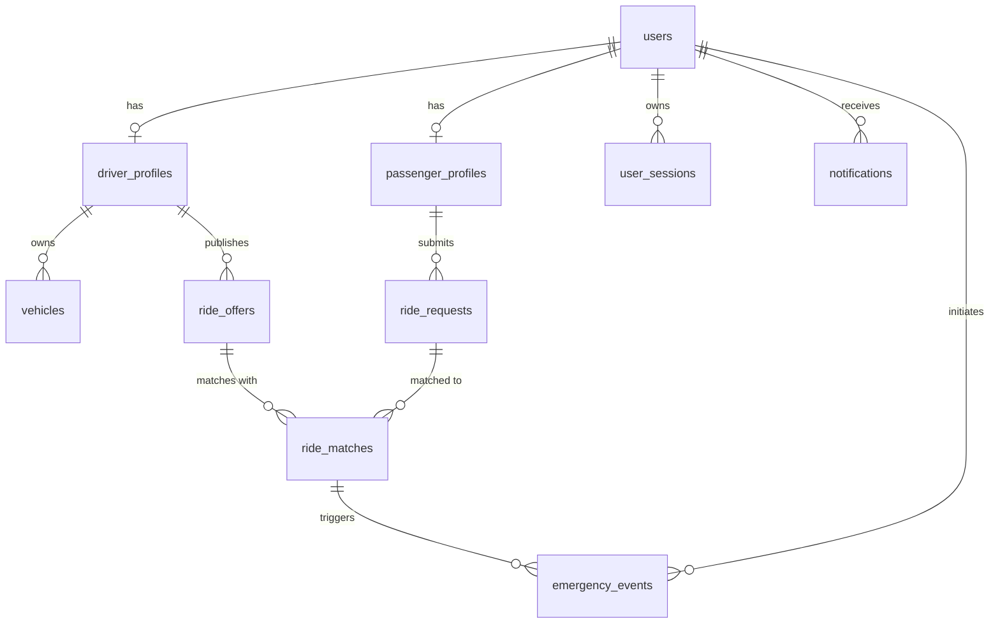

# TERRA | Waypoint Platform — Comprehensive System Documentation

**Author**: Principal Software Engineer & System Architect  
**Platform**: Terra (Modular Urban Operations System)  
**Flagship Module**: Waypoint (Intelligent Commute & Ride Matching Optimization Engine)  
**GitHub Repository**: [https://github.com/akshita19904/Terra](https://github.com/akshita19904/Terra)  

---

## 📖 Executive Overview

**Waypoint** is the foundational mobility and commute optimization module of **Terra**, a modular urban operations platform designed to scale into future civic applications (including **CivicPulse** for infrastructure reporting, **Sentinel** for emergency response, and **Smart Parking**).

Unlike traditional ride-hailing services that rely on brute-force nearest-neighbor proximity searches, Waypoint formulates commute matching as a **multi-objective geospatial optimization problem**. The matching engine balances pickup detours, passenger waiting time, driver trust, vehicle capacity utilization, and route polyline directional alignment.

---

## 🏛️ Architecture & Engineering Principles

The application is structured as a **Modular Monolith** organized into strictly bounded contexts:

```
waypoint/
├── apps/
│   ├── api/                           # Fastify Backend (Modular Monolith - Port 4000)
│   │   ├── prisma/schema.prisma       # Relational + PostGIS Spatial Schema
│   │   ├── src/
│   │   │   ├── platform/              # Terra Shared Platform Kernel (@terra/platform)
│   │   │   │   ├── auth/              # JWT, Password Hashing (bcrypt), RBAC Guards
│   │   │   │   ├── database/          # Prisma Client + Kysely PostGIS Spatial Connection
│   │   │   │   ├── realtime/          # Socket.IO Gateway + Telemetry & Emergency SOS
│   │   │   │   └── spatial/           # Geohash Encoders & Spherical Geometry Math
│   │   │   │
│   │   │   └── modules/waypoint/      # Waypoint Mobility Bounded Context (@terra/waypoint)
│   │   │       ├── matching/          # Multi-Objective Optimization Engine
│   │   │       ├── rides/             # Ride Offers, Requests & Spatial Polylines
│   │   │       ├── users/             # Driver Profiles & Vehicle Management
│   │   │       └── trust/             # Emergency SOS & Ratings Engine
│   │   │
│   │   ├── src/tests/                 # Automated Vitest Test Suite (8/8 Passed)
│   │   └── Dockerfile                 # Multi-Stage API Production Container
│   │
│   └── web/                           # Vite + React 18 + Tailwind UI (Port 3000)
│       ├── src/
│       │   ├── components/            # Dark Glassmorphism Components (#07111F)
│       │   │   ├── common/            # Header, DateTimePicker, Toast, ConfirmationModal
│       │   │   ├── map/               # Mapbox Vector Canvas Visualizer
│       │   │   ├── rides/             # Request Wizard & Scored Candidate Cards
│       │   │   └── analytics/         # Recharts Operations Dashboard
│       │   ├── pages/                 # LoginPage, Dashboard
│       │   └── styles/index.css       # Custom Glassmorphic Tokens & Scrollbars
│       └── Dockerfile                 # Multi-Stage NGINX Production Container
│
├── docker-compose.yml                 # PostGIS + Redis Dev Environment
├── docker-compose.prod.yml            # Production Multi-Stage Deployment Suite
└── README.md                          # Platform Documentation
```

### Engineering Principles Applied:
1. **Single Responsibility per Module**: Controllers, Services, Repositories, and DTOs are isolated within their domain bounded context.
2. **Terra Shared Kernel**: Infrastructure capabilities (JWT Auth, RBAC, Real-time WebSockets, PostGIS spatial queries, Event Bus) are isolated in `@terra/platform` so future modules can reuse them without refactoring Waypoint.
3. **Engine Decoupling (`IMatchingStrategy`)**: The matching engine exposes an abstract strategy interface so heuristic scoring can be swapped with linear programming (MILP) or bipartite solvers without modifying surrounding code.

---

## 🗄️ Database Architecture & PostGIS Spatial Schema

The database is built on **PostgreSQL 16** with the **PostGIS 3.4** spatial extension (SRID 4326 - WGS 84 coordinate reference system).



### Key Tables & PostGIS Columns:
- `users`: Primary identity record (`id`, `email`, `password_hash`, `first_name`, `last_name`, `phone`, `role`, `status`).
- `driver_profiles`: Driver verification (`license_number`, `trust_score`, `current_status`, `last_known_location GEOMETRY(Point, 4326)`, `geohash`).
- `vehicles`: Fleet vehicles (`make`, `model`, `year`, `plate_number`, `total_capacity`, `comfort_class`).
- `ride_offers`: Driver routes (`origin_location Point`, `destination_location Point`, `route_polyline LineString`, `route_geohashes String[]`, `departure_time`, `available_capacity`).
- `ride_requests`: Passenger requests (`pickup_location Point`, `dropoff_location Point`, `desired_departure_time`, `requested_seats`, `max_detour_minutes`).
- `ride_matches`: Matches (`match_score`, `route_similarity_score`, `detour_duration_seconds`, `fare_amount`, `status`).
- `emergency_events`: SOS events (`location Point`, `status`, `notes`).

### Spatial Indexing Strategy:
- **`GiST (route_polyline)`**: Enables $O(\log N)$ PostGIS `ST_DWithin(route_polyline, pickup_location, max_dist)` spatial range queries.
- **`GiST (last_known_location)`**: Sub-millisecond proximity queries for active drivers.
- **`B-Tree (geohash)`**: 5 to 7 character Geohash prefix indexing for fast spatial candidate bucket lookups.

---

## 🧮 Matching Engine & Scoring Algorithms

The matching engine processes requests through a 4-stage optimization pipeline:

### 1. Stage 1: Spatial & Temporal Candidate Pruning ($O(\log N)$)
Filtering candidate ride offers whose route polylines pass within the maximum spatial radius of pickup/dropoff points and whose departure times fall within the flexibility window.

### 2. Stage 2: Polyline Trajectory Alignment
Evaluates directional overlap using vector cosine dot product and Haversine sphere distance:
- **Haversine Distance**:
  $$d = 2R \cdot \arcsin\left(\sqrt{\sin^2\left(\frac{\Delta \phi}{2}\right) + \cos(\phi_1)\cos(\phi_2)\sin^2\left(\frac{\Delta \lambda}{2}\right)}\right)$$
- **Directional Cosine Similarity**:
  $$\text{CosSim} = \frac{\vec{v}_{\text{driver}} \cdot \vec{v}_{\text{passenger}}}{\|\vec{v}_{\text{driver}}\| \|\vec{v}_{\text{passenger}}\|}$$

### 3. Stage 3: Multi-Objective Composite Scoring Function ($S(d, p)$)
$$S(d, p) = 0.35 \cdot \text{Similarity} + 0.25 \cdot \text{DetourScore} + 0.15 \cdot \text{TimeScore} + 0.15 \cdot \text{TrustScore} + 0.10 \cdot \text{Occupancy}$$

### 4. Stage 4: Candidate Ranking & Dynamic Detour Filtering ($O(K \log K)$)
Ranks top-$K$ candidates. Adjusting the Maximum Detour Limit slider dynamically filters out candidates exceeding the limit and recalculates scores in real time.

---

## ⚡ Real-Time Layer & Telemetry

- **Socket.IO Gateway (`socketServer.ts`)**: Handshake JWT authentication verifying user identity before socket connection approval.
- **3-Second Telemetry Ingestion (`driver:location_ping`)**: Ingests driver coordinates, updates PostGIS `last_known_location` & Geohash, and broadcasts `driver:location_update` events with recalculated ETAs.
- **Live Driver-Passenger Chat (`chat:send_message`)**: Encrypts and broadcasts live chat messages (`chat:new_message`) inside match rooms.
- **Emergency SOS Broadcasting (`emergency:sos_trigger`)**: Logs high-priority emergency events into PostGIS and broadcasts system-wide `emergency:alert` signals to dispatchers.

---

## 🇮🇳 India Localization & Pricing Model

- **Default India Coordinates**:
  - Pickup: `Manipal Academy of Higher Education, Bengaluru` (`13.0827° N, 77.5900° E`)
  - Dropoff: `Brigade El Dorado, Aerospace Park, Bengaluru` (`13.1989° N, 77.6358° E`)
- **Currency**: All fares formatted in **Indian Rupees (₹)**.
- **Dynamic Fare Formula**: Base ₹40 + ₹14/km + ₹2.5/min detour.
- **Indian Vehicle Fleet**: Tata Nexon EV, Hyundai Creta SX, Mahindra XUV400 EV.

---

## 🎨 Dark Glassmorphism Design System & UI

- **Color Tokens**: Primary Navy (`#07111F`), Secondary (`#0E1B2E`), Mint Accent (`#65F5C6`), Secondary Accent (`#38D9A9`).
- **UI Components**:
  - `LoginPage.tsx`: Glassmorphic authentication card with email/password fields, show/hide password toggle, and error banners.
  - `Header.tsx`: TERRA branding, live Socket.IO connection status indicator, Emergency SOS button, and profile avatar initials.
  - `MapboxView.tsx`: Dark-v11 vector canvas map visualizer with road grid geometry and pickup/dropoff markers.
  - `DateTimePicker.tsx`: Custom 24-hour local date and time picker popover.
  - `ConfirmationModal.tsx`: Dark glassmorphic modal dialog presenting structured match details.
  - `ToastContainer.tsx`: In-app notification queue for SOS triggers and system notifications.
  - `CandidatesList.tsx`: Ranked candidate cards displaying rounded match percentage badges (**95%**), detour mins, and ₹ fares.
  - `AnalyticsDashboard.tsx`: Recharts area graph tracking hourly commute matches, CO₂ emissions reduced (kg), and vehicle detours saved (mins).

---

## 🧪 Automated Test Suite (Vitest)

All **8 unit tests** across 3 test files pass 100% cleanly:
- `polylineSimilarity.test.ts`: Haversine distance, vector directional cosine similarity, route alignment scores.
- `heuristicScorer.test.ts`: Multi-objective match score $S(d, p)$ calculation and driver trust penalties.
- `geohash.test.ts`: 5-char and 7-char Geohash precision encoding.

---

## 🚢 Deployment & Containerization Guide

### Local Development:
```bash
# Clone repository
git clone https://github.com/akshita19904/Terra.git
cd Terra

# Boot PostgreSQL 16 + PostGIS & Redis
docker-compose up -d

# Run API Backend
cd apps/api
npm install
npx prisma generate
npm run dev

# Run Web UI
cd apps/web
npm install
npm run dev
```

### Production Multi-Stage Deployment:
```bash
docker-compose -f docker-compose.prod.yml up --build -d
```
