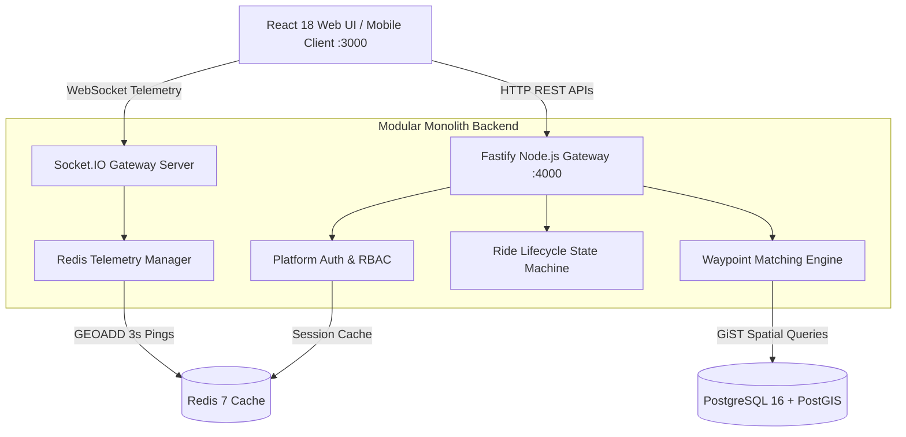

# 02. High-Level Architecture

## 1. System Architecture Diagram
The diagram below illustrates the full architecture of Terra and Waypoint, showing how the React 18 Web Dashboard communicates with the Fastify Modular Monolith backend, Socket.IO WebSockets, PostgreSQL 16 + PostGIS, and Redis 7.



---

## 2. What is a "Modular Monolith"?
In plain terms:
- A **Monolith** is a single software application where all code is packaged and deployed together in one container.
- A **Modular Monolith** is a monolith where the codebase is strictly organized into decoupled, independent modules with clean boundaries (`@terra/platform` for infrastructure kernel, `@terra/waypoint` for mobility domain).

Modules are not allowed to reach directly into another module's internal files or database tables. All communication happens through well-defined TypeScript interfaces.

---

## 3. Why Modular Monolith over Microservices?

### What this project GAINED by choosing a Modular Monolith:
1. **Zero Network Overhead ($<0.1\text{ms}$ Latency)**: Calling platform auth or spatial functions from Waypoint happens in-memory within the Node.js process. Microservices would add $50-200\text{ms}$ of network latency per HTTP/gRPC hop.
2. **ACID Transaction Simplicity**: Booking a ride requires updating the driver offer, creating a passenger request, and setting a match status simultaneously. PostgreSQL handles this atomically in a single transaction (`prisma.$transaction`). Microservices require complex distributed sagas and two-phase commits.
3. **Single Command Deployment**: The entire platform compiles into one Docker container deployed via `docker-compose.prod.yml`.
4. **Developer Velocity**: No need to manage 10 different git repos, Kubernetes clusters, service meshes (Istio), or API gateways on day 1.

### What this project LOST (Tradeoffs accepted):
1. **Independent Scaling**: If Waypoint spatial matching consumes 90% CPU, the entire Node.js container must be scaled, rather than scaling just the matching service.
2. **Polyglot Flexibility**: All modules must be written in Node.js/TypeScript. We cannot write the matching engine in C++ or Rust while keeping the API in Node.js within the same process.

---

## 4. Migration Path to Microservices (If Scaling Required Later)

If Terra reaches 100,000+ concurrent requests, here is the concrete step-by-step migration plan:

```
Step 1: Extract Shared Kernel into NPM Package / Private Submodule
        (@terra/platform -> Shared Auth & Spatial Package)
                          │
                          ▼
Step 2: Split Monolith Gateway into Independent Services
        - Waypoint Service (:4001)
        - Sentinel Emergency Service (:4002)
        - Telemetry Ingestion Service (:4003)
                          │
                          ▼
Step 3: Introduce API Gateway (Kong / NGINX) & Event Bus (Apache Kafka)
```

Because our code is already isolated inside `apps/api/src/platform` and `apps/api/src/modules/waypoint`, extracting Waypoint into an independent service requires **zero domain refactoring**—only swapping in-memory function calls with gRPC/HTTP client calls.
