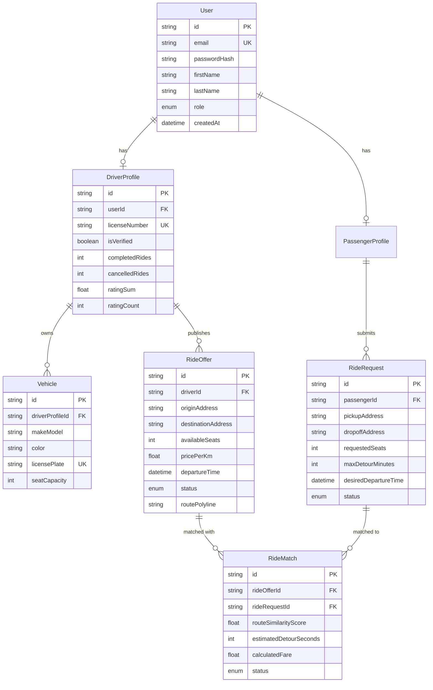

# 04. Database Design & Spatial Schema

This document details the PostgreSQL 16 + PostGIS relational database architecture configured in `apps/api/prisma/schema.prisma`.

---

## 1. Full Entity-Relationship (ER) Diagram

---

## 2. Table-by-Table Plain English Breakdown

### `User` Table
Stores basic account metadata for all platform accounts.
- `id`: UUID unique primary key.
- `email`: User's login email address (unique index).
- `passwordHash`: Salted bcrypt password hash (never plain text).
- `role`: Account permissions (`PASSENGER`, `DRIVER`, `ADMIN`).

### `DriverProfile` & `PassengerProfile` Tables
Separate extension tables linked 1-to-1 with `User`.
- `isVerified`: Identity verification flag for safety compliance.
- `completedRides` & `cancelledRides`: Tracks driver reliability for Trust Score calculations.
- `ratingSum` & `ratingCount`: Stores aggregate feedback to compute average rating ($\text{Rating} = \text{ratingSum} / \text{ratingCount}$).

### `Vehicle` Table
Stores driver vehicle specifications.
- `seatCapacity`: Total available seats for commute pooling.

### `RideOffer` Table
Represents a commute published by a driver.
- `routePolyline`: Encoded polyline or PostGIS `LineString` vector representing the driver's planned route graph.
- `departureTime`: Timestamp when the driver intends to leave.
- `status`: State machine indicator (`CREATED`, `SEARCHING`, `COMPLETED`, `CANCELLED`).

### `RideRequest` Table
Represents a ride match request submitted by a passenger.
- `maxDetourMinutes`: Maximum acceptable pickup detour time limit set by passenger.

---

## 3. Why PostGIS Specifically?

If we stored coordinates as plain numeric columns (`pickup_lat`, `pickup_lng`), calculating driver proximity would require running the spherical Haversine formula across **every row in the table** using a full table scan ($O(N)$ time complexity).

With **PostGIS**, spatial coordinates and polylines are stored as native geometric geometries (`GEOMETRY(Point, 4326)` and `GEOMETRY(LineString, 4326)`). This enables:
- **`ST_DWithin(route_polyline, pickup_point, 1500)`**: Evaluates whether a pickup location lies within 1,500 meters of a driver's route polyline using spatial index trees in **$O(\log N)$** time.
- **`ST_Distance()`**: Calculates exact geodesic spherical distances on the WGS 84 ellipsoid.

---

## 4. Indexing Strategy

1. **GiST Spatial Polyline Indexes**: A Generalized Search Tree (`GiST`) index is built on `RideOffer.routePolyline`. This indexes 2D bounding boxes hierarchically, allowing PostGIS to filter out 95% of irrelevant city routes in $<10\text{ms}$.
2. **5-Character Geohashes**: Geohashing encodes latitude/longitude into a 5-char string (e.g. `tdr1v`). Geohash strings are indexed with standard B-Tree indexes, enabling ultra-fast bucket filtering.
3. **Foreign Key Indexes**: B-Tree indexes on `userId`, `driverId`, and `passengerId` prevent full table scans during relational joins.

---

## 5. Schema Tradeoffs & Denormalizations

- **Denormalized Ratings (`ratingSum` + `ratingCount`)**: Instead of running an expensive `AVG(rating)` SQL aggregate query across thousands of historical review rows every time a ride is booked, we store running totals in `DriverProfile`. This turns rating lookups into an $O(1)$ read operation.
