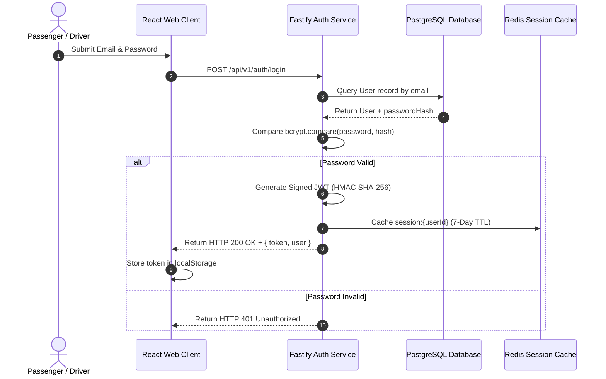

# 07. Authentication & Authorization

This document details the stateless JSON Web Token (JWT) authentication, password security, and Role-Based Access Control (RBAC) implemented in `apps/api/src/platform/auth`.

---

## 1. End-to-End Authentication Lifecycle



---

## 2. Token Security & Hashing Standards

- **Stateless JWT Tokens**: Signed using HMAC SHA-256 algorithm with `JWT_SECRET`. Tokens contain `userId`, `email`, and `role`.
- **Password Security**: Passwords are never stored in plain text. They are hashed using `bcryptjs` with **12 salt rounds** before insertion into PostgreSQL.

---

## 3. The Dedicated Login Page Experience

### Evolution & Feedback:
- **Initial State**: Early testing relied on auto-generated mock user sessions, which made the platform feel stateless and prevented user testing of personalized ride histories.
- **Redesign & Addition**: Added a dedicated glassmorphism **Login & Registration Page** (`apps/web/src/pages/LoginPage.tsx`) with pre-populated quick demo persona logins (e.g. `Passenger Demo` vs `Driver Demo`).

---

## 4. Role-Based Access Control (RBAC)

Terra enforces strict Role-Based Access Control using Fastify `preHandler` route guards:

- `PASSENGER`: Can search, request, accept, and rate commutes.
- `DRIVER`: Can publish route offers, update vehicle profiles, and transition ride state machine statuses (`DRIVER_EN_ROUTE`, `RIDE_IN_PROGRESS`).
- `ADMIN`: Platform operators with access to system telemetry, SOS emergency overrides, and module roadmaps.

```typescript
// Role Authorization Guard Example (apps/api/src/platform/auth/auth.service.ts)
export const authorizeRoles = (allowedRoles: string[]) => {
  return async (req: FastifyRequest, reply: FastifyReply) => {
    if (!req.user || !allowedRoles.includes(req.user.role)) {
      reply.status(403).send({
        success: false,
        error: { code: 'FORBIDDEN', message: 'Insufficient role permissions' }
      });
    }
  };
};
```
