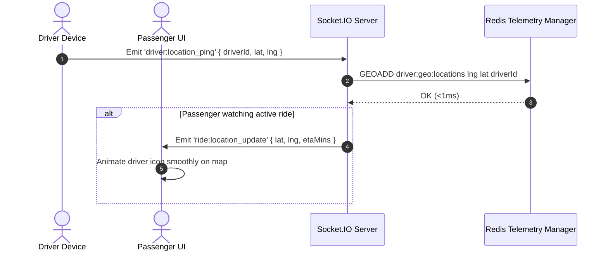

# 08. Real-Time Telemetry & Socket.IO System

This document details the real-time full-duplex communication infrastructure implemented in `apps/api/src/platform/realtime/socketServer.ts`.

---

## 1. Socket.IO Infrastructure & Event Lifecycle

Socket.IO attaches directly to Fastify's raw HTTP server instance (`fastify.server`). It establishes full-duplex WebSocket channels between client browsers and the backend.

### Connection Lifecycle:
1. **Handshake & Auth**: Client connects via `io('http://localhost:4000', { auth: { token } })`. Backend verifies JWT before accepting socket connection.
2. **Room Subscription**: Sockets join specific rooms based on ride IDs (`ride:ride_101`) or driver IDs (`driver:drv_404`).
3. **Heartbeat Pings**: Ping/pong heartbeats maintain connection health every 25 seconds.

---

## 2. Real-Time Event Matrix

| Event Name | Direction | Payload Description |
| :--- | :--- | :--- |
| `driver:location_ping` | Client ➔ Server | Driver sends current GPS coordinates (`lat, lng, heading`) every 3 seconds. |
| `ride:state_changed` | Server ➔ Client | Broadcasts ride state transitions (`MATCHED` ➔ `DRIVER_EN_ROUTE`). |
| `emergency:sos_trigger` | Client ➔ Server | High-priority SOS panic signal containing GPS location. |
| `emergency:alert` | Server ➔ All Clients | Broadcasts emergency SOS alert to nearby dispatchers and emergency contacts. |

---

## 3. Real-Time Sequence Diagram

---

## 4. Disconnect & Reconnect Resilience

- **Transient Disconnection**: If a driver passes through a tunnel or cellular dead zone, Socket.IO buffers outgoing pings locally for up to 30 seconds.
- **Automatic Reconnection**: Upon network restoration, the client reconnects automatically, re-subscribes to its assigned ride room (`ride:ride_101`), and fetches missed telemetry updates.
- **Server TTL Cleanup**: If a driver disconnects for $>60$ seconds, their active Redis location key expires automatically via TTL, preventing ghost drivers from showing on passenger search maps.
